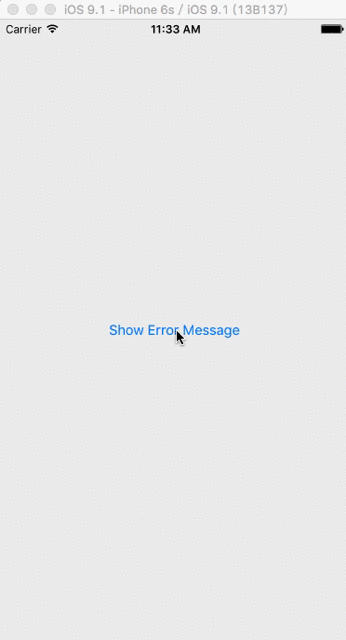

# YJMessage

A library that displays message in iOS app with Android Snackbar-like style.

## Demo



## Installation

Add the following line in your Podfile:

```
pod "YJMessage"
```

## Usage

The usage is simple, similar to TSMessages.

```objective-c
// basic
[YJMessage showMessageInViewController:self
                                     title:@"Hi, there"
                                  duration:1.5f
                                      type:YJMessageTypeInfo];

// show message with completion callback
[YJMessage showMessageInViewController:self
                                    title:@"hi, there"
                                 duration:1.5f
                                     type:YJMessageTypeInfo
                                 callback:^() {
                                     NSLog(@"message showed");
                                 }];

// show message with a button
[YJMessage showMessageInViewController:self
                                     title:@"hey, error!"
                                  duration:1.5f
                                      type:YJMessageTypeInfo
                                  callback:nil
                               buttonTitle:@"tap me"
                            buttonCallback:^{
                                NSLog(@"Tapped.");
                            }];
```

## YJMessageType

### YJMessageTypeInfo


### YJMessageTypeError


### YJMessageTypeSuccess


### YJMessageTypeWarning


